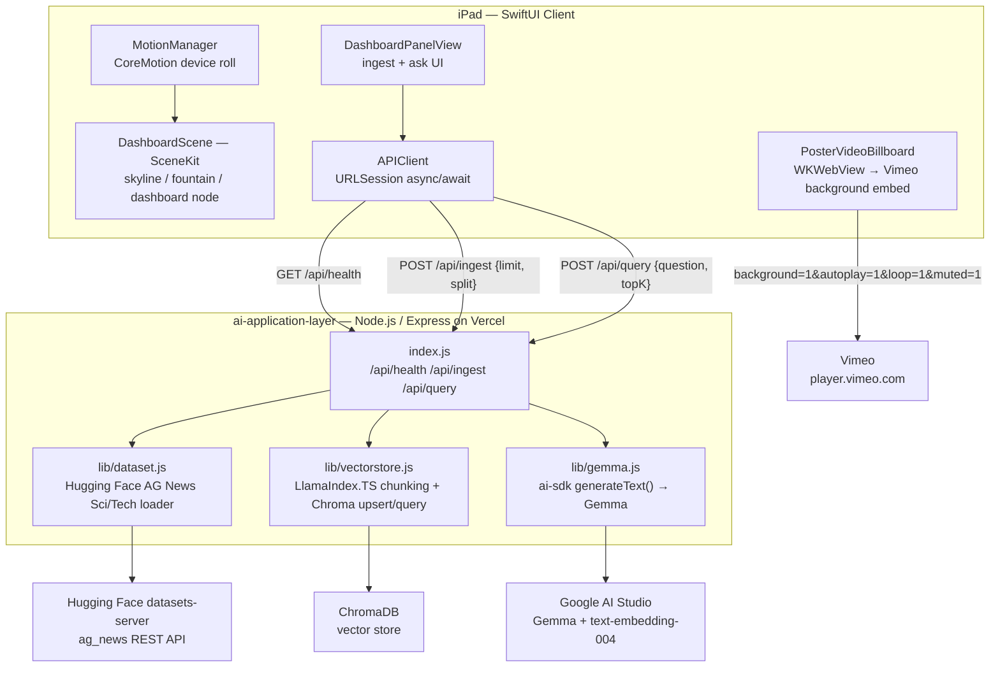

# AI Application Layer — SwiftUI Toy-City Dashboard

A SwiftUI + SceneKit iPad client for the **ai-application-layer** Gemma RAG
backend, staged as an interactive 3D Smart Supply Chain Optimization Dashboard — motion-tilt parallax,
a day/afternoon/night skyline, a stone-paved plaza, and a poster that turns
into a looping video while the tablet is in motion. Under the hood it calls
the exact same **Node.js / Express** API — `https://ai-application-layer.vercel.app`,
source at [`techplanshetyapps/ai-application-layer`](https://github.com/techplanshetyapps/ai-application-layer) —
which ingests only the **Sci/Tech** slice of the AG News dataset directly from
Hugging Face, indexes it in **ChromaDB** using **LlamaIndex.TS** for chunking,
and answers questions about the articles using a **Gemma** model called
through the **Vercel AI SDK (ai-sdk)**.

---

<p>
  
  
  
  
  
  
  
  
  
  
  
  
  
</p>

---

## Table of contents

- [Tech stack](#tech-stack)
- [Architecture](#architecture)
  - [System overview](#system-overview)
  - [SwiftUI client layer](#swiftui-client-layer)
  - [Node.js backend — ai-application-layer](#nodejs-backend--ai-application-layer)
  - [How data is fetched](#how-data-is-fetched)
- [Repository structure](#repository-structure)
- [Features](#features)
- [Setup and build (.ipa via Apple Configurator)](#setup-and-build-ipa-via-apple-configurator)

---

## Tech stack

*   **Client platform:** macOS Ventura 16.7.8, Xcode 15.2, Apple Configurator
*   **UI framework:** SwiftUI (declarative views, `@StateObject`/`@State` reactivity)
*   **3D scene:** SceneKit — procedural skyscrapers, dashboard panel node, fountain particle system
*   **Motion input:** CoreMotion (`CMMotionManager`) — device roll drives scene lean + parallax
*   **Video embed:** WKWebView loading Vimeo's `player.vimeo.com` background-mode embed (muted, looping, autoplay)
*   **Networking:** `URLSession` (async/await) against the deployed Node.js API
*   **Deployment target:** iPadOS/iOS, distributed as a signed `.ipa` for installation via Apple Configurator 2 (not App Store)

---

## Architecture

### System overview

The SwiftUI app is a pure **consumer** of the Node.js backend's HTTP API — it
holds no model weights, no vector store, and no dataset locally. Everything
RAG-related (retrieval, embedding, generation) happens server-side; the
client's job is motion input, 3D rendering, and rendering whatever JSON comes
back from `/api/*`.



| Layer | Contract | Why it's isolated this way |
|---|---|---|
| SwiftUI ↔ Node | `POST /api/ingest {limit, split} → {message, articlesIngested, chunksIngested, sample}`; `POST /api/query {question, topK} → {answer, provider, model, sources[]}` | The client never touches Hugging Face, Chroma, or Gemma directly — it only speaks the same JSON contract `public/index.html` already used, so the web dashboard and this native app are interchangeable frontends for one backend |
| Node ↔ Hugging Face | `datasets-server` REST `rows` endpoint, filtered client-side to `label == 3` (Sci/Tech) | No dataset is bundled with either the backend or the SwiftUI app — articles are fetched live on each ingest call |
| Node ↔ Chroma | LlamaIndex.TS `SentenceSplitter` chunks → `ai-sdk embed()` (`text-embedding-004`) → Chroma upsert/query | Embeddings and chunking stay entirely server-side; the SwiftUI app never sees raw vectors, only the final ranked `sources[]` |
| Node ↔ Gemma | `ai-sdk generateText()` against Google AI Studio's Generative Language API | Swappable model id (`GEMMA_MODEL` env var) without any client-side change |
| SwiftUI ↔ Vimeo | Direct `WKWebView` load of `player.vimeo.com/video/{id}?background=1` | Video playback is entirely client-side and unrelated to the RAG backend |

---

### SwiftUI client layer

- **`MotionManager`** — reads `CMDeviceMotion.attitude.roll`, low-pass filters it into `leanAngle`, and derives a boolean `isMoving` from the rate of change. This one signal drives three separate visual effects: the 3D scene's camera/dashboard lean, the poster↔video swap, and the fountain's static↔flowing state.
- **`DashboardScene`** — owns the `SCNScene`: procedural skyscrapers (window-grid textures, floor ledges, corner trim, rooftop props), a stone-pavement ground plane, the fountain particle system, and `setTimeOfDay(_:)` for the Day/Afternoon/Night lighting + sky presets.
- **`DashboardPanelView`** — the actual functional UI (ingest controls, question field, cited answer list), composited on top of the 3D scene and leaned in 3D to match the `dashboardNode`.
- **`APIClient`** — thin async/await wrapper matching `index.js`'s exact response shapes; no guessed fields.
- **`HomeContactView`** — Home/Connect circles opening sheets with LinkedIn, Vimeo, and GitHub slug links.

### Node.js backend — ai-application-layer

```
Hugging Face (ag_news, Sci/Tech only)
        │  datasets-server REST API
        ▼
  lib/dataset.js  ── fetch + filter label==3
        ▼
  lib/vectorstore.js
        │  LlamaIndex SentenceSplitter → chunks
        │  ai-sdk embed() → text-embedding-004
        ▼
      ChromaDB (vector store)
        ▲
        │  similarity search (top-k)
  lib/vectorstore.js retrieve()
        │
        ▼
  index.js  /api/query
        │  builds RAG prompt with numbered context
        ▼
  lib/gemma.js  ── ai-sdk generateText() → Gemma (gemma-3-27b-it)
        ▼
   Answer + cited sources → SwiftUI DashboardPanelView (or public/index.html)
```

This is the same backend described in the Node app's own README: Express
routes in `index.js`, a Hugging Face loader in `lib/dataset.js`, LlamaIndex.TS
chunking + Chroma storage/retrieval in `lib/vectorstore.js`, and Gemma
generation/embeddings via `ai-sdk` in `lib/gemma.js`. The SwiftUI app adds no
new backend logic — it's a second frontend against the identical API surface
already serving `public/index.html`.

---

### How data is fetched

1. **Ingest, triggered from the SwiftUI dashboard's "Ingest Sci/Tech Articles" button** → `APIClient.ingest(limit:split:)` → `POST https://ai-application-layer.vercel.app/api/ingest`.
2. The Vercel-hosted `index.js` calls `lib/dataset.js`, which pages through Hugging Face's `datasets-server` REST API (`https://datasets-server.huggingface.co/rows?dataset=fancyzhx/ag_news...`), keeping only Sci/Tech-labeled rows (`label == 3`).
3. `lib/vectorstore.js` chunks those articles (LlamaIndex.TS `SentenceSplitter`), embeds each chunk via `ai-sdk`'s `embed()` (`text-embedding-004`), and upserts into ChromaDB.
4. **Querying, from the SwiftUI dashboard's "Ask Gemma" field** → `APIClient.query(_:topK:)` → `POST /api/query {question, topK}`.
5. `index.js` retrieves the top-k nearest chunks from Chroma, builds a numbered-context RAG prompt, and calls `lib/gemma.js`'s `gemmaGenerate()`, which hits Google AI Studio's Gemma endpoint through `ai-sdk`'s `generateText()`.
6. The JSON response (`{answer, provider, model, sources[]}`) is decoded by `APIClient.QueryResponse` and rendered directly in `DashboardPanelView` — no client-side parsing of HTML, no scraping; it's the same structured API the Node app's own dashboard (`public/index.html`) consumes.

No dataset, embeddings, or model weights are ever downloaded to the iPad —
the SwiftUI app only ever sees the final `answer`/`sources` JSON.

---

## Repository structure

```
.
├── AIApplicationLayerApp/
│   ├── AIApplicationLayerApp.swift   # @main App entry point
│   ├── ContentView.swift             # 3D scene host + dashboard/poster/fountain composition
│   ├── DashboardScene.swift          # SceneKit scene: skyline, ground, fountain, day/night lighting
│   ├── DashboardPanelView.swift      # Ingest + Ask UI, wired to APIClient
│   ├── APIClient.swift               # async/await client for /api/health, /api/ingest, /api/query
│   ├── MotionManager.swift           # CoreMotion tilt → leanAngle / isMoving
│   ├── PosterVideoBillboard.swift    # Poster ⇄ looping muted Vimeo video swap
│   └── HomeContactView.swift         # Home/Connect circles → LinkedIn/Vimeo/GitHub slugs
└── README.md
```

Backend repository (consumed, not vendored — see [ai-application-layer](https://github.com/techplanshetyapps/ai-application-layer)):

```
.
├── index.js                # Express app: /api/ingest, /api/query, /api/health
├── lib/
│   ├── dataset.js           # Hugging Face AG News Sci/Tech loader
│   ├── vectorstore.js        # LlamaIndex chunking + ChromaDB storage/retrieval
│   └── gemma.js              # ai-sdk Gemma generation + embeddings
├── public/index.html        # Web dashboard UI (the SwiftUI app's sibling frontend)
├── vercel.json               # Vercel deployment routing
├── .env.example
├── KAGGLE_WRITEUP.md
└── DEVPOST.md
```

---

## Features

| Feature | Notes |
|---|---|
| 3D skyline, dashboard panel, fountain (SceneKit) | Procedural window-grid textures, floor ledge bands, corner trim pillars, rooftop setback tiers, rooftop props (antenna, AC units, water tanks); ground plane is a tiled procedural stone-pavement texture |
| Day / Afternoon / Night control | Segmented picker calls `DashboardScene.setTimeOfDay(_:)` — swaps sky color, key/ambient/rim lighting, and building window glow |
| Motion-driven lean/parallax | `MotionManager.leanAngle` rotates the dashboard panel and pans the camera as the tablet tilts left/right |
| Poster ⇄ looping muted video | `PosterVideoBillboard` swaps to a muted, looping `WKWebView` Vimeo embed while `isMoving`, reverts to a poster placeholder at rest |
| Fountain static ⇄ flowing | Same `isMoving` signal toggles the fountain's `SCNParticleSystem` birth rate |
| Home / Connect circles | Open sheets with LinkedIn, Vimeo, and GitHub slug links; full-row tappable |
| Ingest + Ask Gemma | `DashboardPanelView` mirrors `public/index.html`'s functionality against the real `/api/ingest` and `/api/query` endpoints |

---

## Setup and build (.ipa via Apple Configurator)

1. Open Xcode (15.2) → **File → New → Project → iOS App**, SwiftUI interface, a clean product name (no punctuation).
2. Drag in all `.swift` files from `AIApplicationLayerApp/`, checking **Copy items if needed** and the app target's membership checkbox.
3. **Signing & Capabilities** → select your Apple Developer team.
4. **Info.plist** → confirm `NSMotionUsageDescription` is set (CoreMotion requires it).
5. Build and test on a physical iPad — CoreMotion tilt doesn't work in the Simulator.
6. **Product → Archive** → **Distribute App** → export the `.ipa`.
7. Open **Apple Configurator 2** → drag the exported `.ipa` onto your connected iPad to install it.
